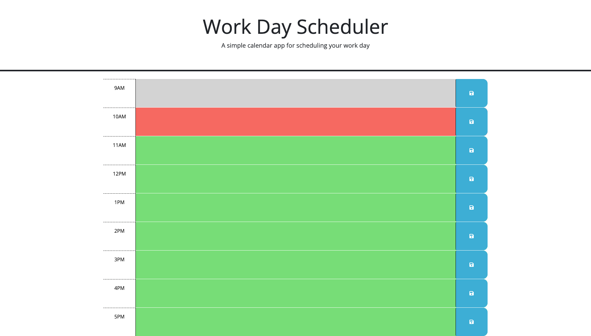

# Work Day Scheduler

This application is designed to keep track of what needs to get done during a work day. Broken down by hour, it is meant to make life easier to keep track of and manage time.

## Usage

The user will input anything they would like to get done within the hour.
Once they decide it is needed, they can click the save button.
The box will change from green, to red to gray.
Green for the hour having not yet passed, red for it being the current hour
and gray for it being an hour that has already passed.
If the users leaves the page, the information they have chosen to save
will be stored in local storage and will be presented to them upon their
return to the application.

## Screenshot

## License

[MIT](https://choosealicense.com/licenses/mit/)

## Contact
GitHub: [My Profile](https://github.com/ColtonSiegmund)

E-mail: [My E-Mail](mailto:coltondrums@gmail.com)

Project Link: [View Project]()